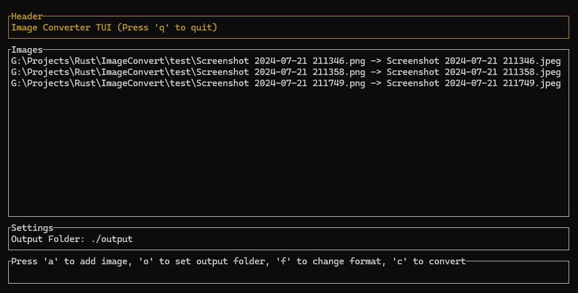

# Image Converter

A simple Terminal User Interface (TUI) application for batch converting images between different formats.

## Features

- 🚀 Convert images to PNG, JPEG, WebP, and GIF formats
- 📂 Batch processing support for handling multiple files at once
- 🛠️ Configurable output directory for better file organization
- 🎹 Keyboard-driven interface for quick and seamless navigation

## Requirements

To build and run the **Image Converter** TUI, you need:
- **Rust** and **Cargo** (latest stable version recommended)
- The following dependencies:
  - `ratatui` (for the TUI interface)
  - `crossterm` (for terminal handling)
  - `image` (for image format conversions)

## Installation

Clone the repository:

```shell
git clone https://github.com/RareHyperIonYT/Image-Converter.git
cd image-converter
```

Build the application:

```shell
cargo build --release
```

The compiled binary will be available at:
```shell
target/release/image-converter
```

## Usage

Once you run the application, you will be presented with a TUI that displays the current images along with controls.



## Controls

| Key | Action                                 |
|-----|----------------------------------------|
| `A` | Add images to the list of conversions. |
| `C` | Cycles between output formats.         |
| `O` | Set output directory of images.        |
| `Q` | Quit the application.                  |

---

⭐ If you find this project useful, consider giving it a star on GitHub!

📜 This project is under the [MIT License](LICENSE).
